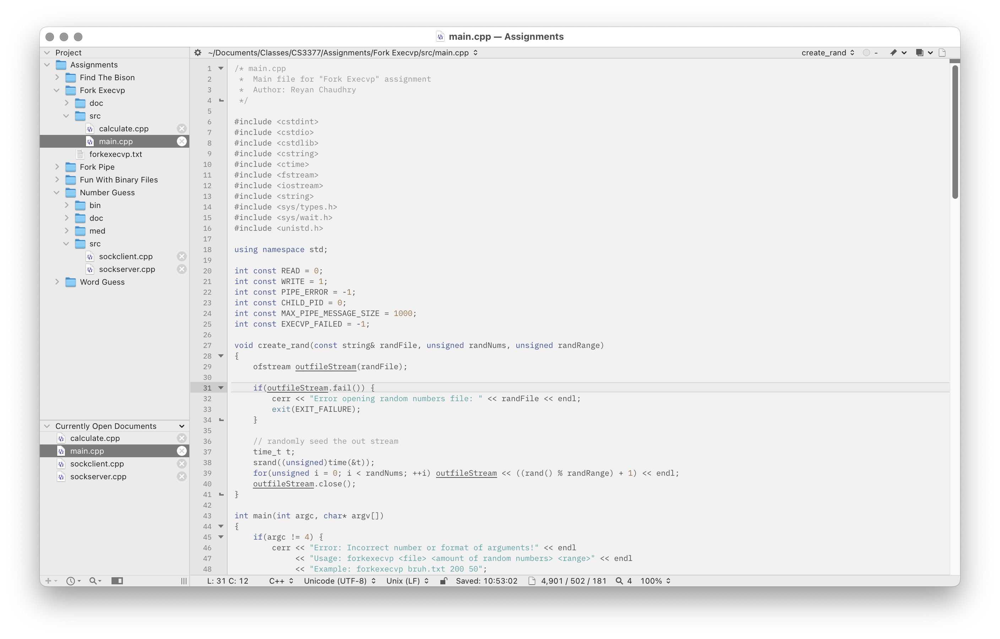
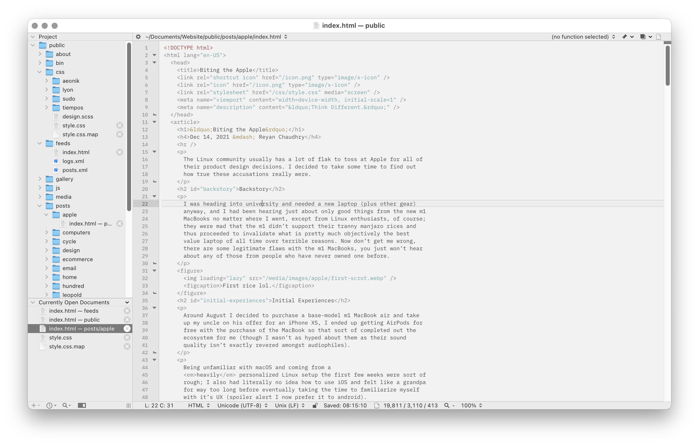
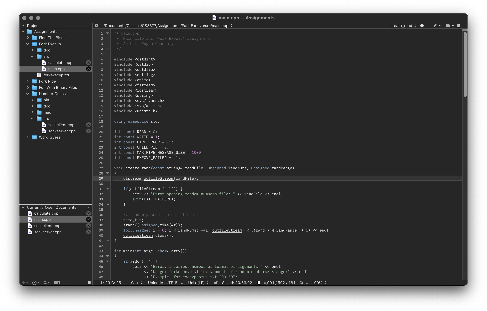
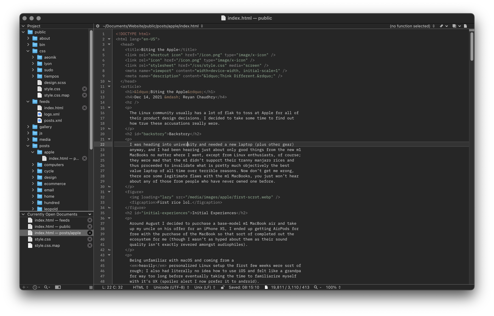

<h1 align="center">Yesterday</h1>

As you may have already noticed, "Yesterday" is a play on words of the name of an already very popular family of color schemes called [Tomorrow](https://github.com/chriskempson/tomorrow-theme) by Chris Kempson, I've always liked that colorscheme but found some it's ports and design decisions not up to my taste, hence the creation of Yesterday for BBEdit, the finest editor on the Macintosh! Yesterday has been meticulously optimized for every bit of syntactic sugar that BBEdit supports, so you won't be missing out on anything by switching over.

I haven't yet considered porting this to other editors/apps yet (especially since it isn't awfully original) but may think about it at a later date. Yesterday does, however, come in both light and dark styles to suit everyone. It also remains easy on the eyes in both forms.

